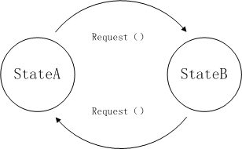

### 模式动机
在很多情况下，一个对象的行为取决于一个或多个动态变化的属性，这样的属性叫做状态，这样的对象叫做有状态的(stateful)对象，这样的对象状态是从事先定义好的一系列值中取出的。当一个这样的对象与外部事件产生互动时，其内部状态就会改变，从而使得系统的行为也随之发生变化。
### 模式定义
状态模式(State Pattern) ：允许一个对象在其内部状态改变时改变它的行为，对象看起来似乎修改了它的类。其别名为状态对象(Objects for States)，状态模式是一种对象行为型模式。

### 模式结构
状态模式包含如下角色：

- Context: 环境类
- State: 抽象状态类
- ConcreteState: 具体状态类

### 时序图

既然是状态模式，加上状态图，对状态转换间的理解会清晰很多：

### 模式分析
状态模式描述了对象状态的变化以及对象如何在每一种状态下表现出不同的行为。
状态模式的关键是引入了一个抽象类来专门表示对象的状态，这个类我们叫做抽象状态类，而对象的每一种具体状态类都继承了该类，并在不同具体状态类中实现了不同状态的行为，包括各种状态之间的转换。
### 优点
状态模式的优点

封装了转换规则。
枚举可能的状态，在枚举状态之前需要确定状态种类。
将所有与某个状态有关的行为放到一个类中，并且可以方便地增加新的状态，只需要改变对象状态即可改变对象的行为。
允许状态转换逻辑与状态对象合成一体，而不是某一个巨大的条件语句块。
可以让多个环境对象共享一个状态对象，从而减少系统中对象的个数。
### 缺点
状态模式的缺点

状态模式的使用必然会增加系统类和对象的个数。
状态模式的结构与实现都较为复杂，如果使用不当将导致程序结构和代码的混乱。
状态模式对“开闭原则”的支持并不太好，对于可以切换状态的状态模式，增加新的状态类需要修改那些负责状态转换的源代码，否则无法切换到新增状态；而且修改某个状态类的行为也需修改对应类的源代码。
### 适用环境
在以下情况下可以使用状态模式：

对象的行为依赖于它的状态（属性）并且可以根据它的状态改变而改变它的相关行为。
代码中包含大量与对象状态有关的条件语句，这些条件语句的出现，会导致代码的可维护性和灵活性变差，不能方便地增加和删除状态，使客户类与类库之间的耦合增强。在这些条件语句中包含了对象的行为，而且这些条件对应于对象的各种状态。
